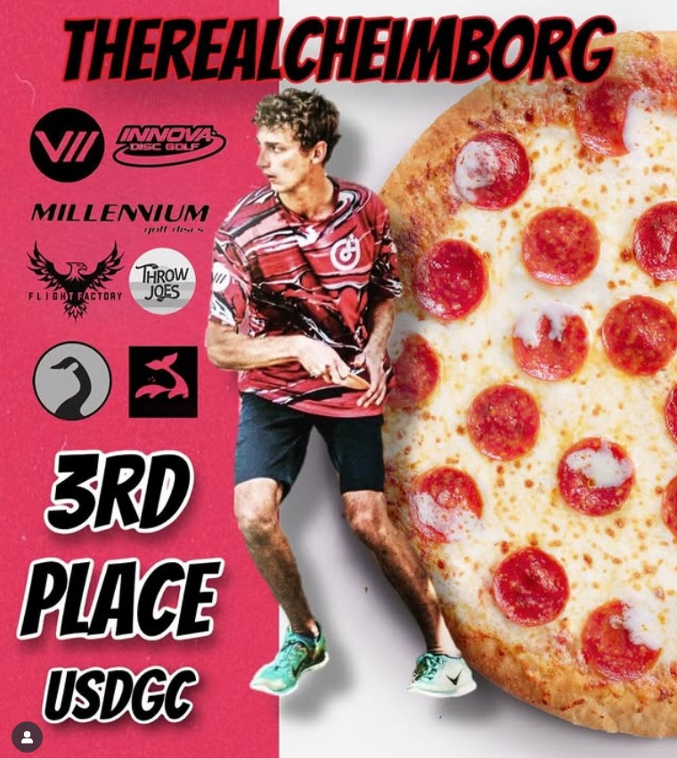

Heimburglandia offers a range of tasty food options that can be found all over the quaint village.

## Pizza

A staple of Heimbuglandia due to his pizza style putt, the signature element of italian cusine can be found across the village.

Photo Credit: theRealCheimborg parody instagram account, October 2022

## Alligator

Another signature cusine of Heimburglandia, based on Calvin's Floridian origins, Alligator is available at several locations across the settlement.

## Tacos

Another classic frisbee term inspires cuisine in Heimburglandia. The tacos in Heimburglandia are piled high with delectable moresels, while the shells look like a disc folded in half after raging over a missed putt.

Photo Credit: Pintrest, disc stuck in cage